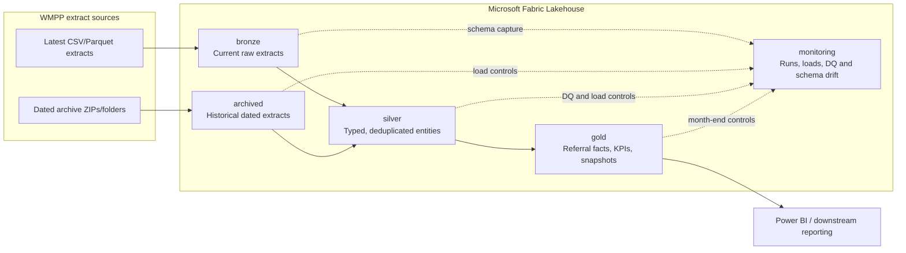
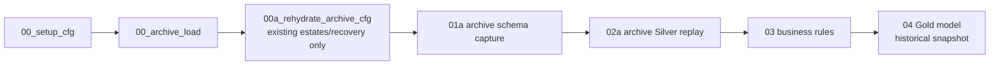
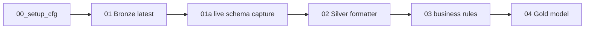

# High-Level Design (HLD)

**Project:** West Midlands Placement Portal data platform
**Client:** Birmingham Children's Trust
**Platform:** Microsoft Fabric Lakehouse
**Status:** Current implementation baseline
**Baseline date:** 16 August 2026

## 1. Purpose

This document defines the high-level architecture for ingesting WMPP current
and historical extracts, conforming them into a governed Silver layer, applying
data-quality controls, and publishing a Gold referral model for reporting.

The solution supports two operational streams:

1. **Historical archive hydration** — builds the archive, replays canonical
   monthly Silver states, and writes historical Gold snapshots.
2. **Business-as-usual latest processing** — loads the latest extracts through
   Bronze, Silver, data quality, and Gold.

## 2. Architecture overview

## 3. Logical layers

| Layer | Purpose | Key characteristics |
|---|---|---|
| Lakehouse Files | Landing and configuration | Latest shortcut, dated archive folders, `Files/cfg_files` |
| `bronze` | Current raw ingestion | Source fidelity plus ingestion lineage and `export_date` |
| `archived` | Historical raw ingestion | One dated slice per file/export with archive lineage |
| `silver` | Conformed entities | Contract-driven types, PK deduplication, consistent naming |
| `gold` | Reporting model | Referral facts/views and dated snapshot table |
| `monitoring` | Operational control | Idempotency, retries, drift lifecycle, DQ results and metrics |

## 4. Processing streams

### 4.1 Historical archive hydration

Archive exports are treated as complete table snapshots. The replay selects
the final available export in each calendar month and, for each table, uses its
latest available export on or before that canonical date. DQ and Gold are
orchestrated after a successful monthly Silver state.

### 4.2 BAU latest processing

The latest stream overwrites/refreshed current Bronze entities, captures schema
drift against the approved contract, formats the newest export into Silver,
then runs DQ and Gold.

## 5. Configuration and governance

- `00_setup_cfg.ipynb` is the sole owner of configuration-table DDL and
  non-destructive legacy column upgrades.
- `schema_definition.csv` is the approved schema, PK, and FK contract.
- `dq_rule_definition.csv` contains supplementary DQ rules.
- `ref_*` internal/reference tables are excluded through `common_util.ipynb`;
  they are not dated business extracts.
- Schema changes are recorded in `monitoring.cfg_schema_drift_event`; the
  approved definition is materialised in
  `monitoring.cfg_schema_drift_definition`.
- ETL defects and material implementation changes are recorded separately in
  `change tracking/ETL_ISSUE_AND_CHANGE_LOG.md`.

## 6. Resilience and recoverability

- Archive ZIP/file controls and Silver export controls make runs resumable.
- `SUCCESS` with `reload = false` is skipped; failed, interrupted, unseen, or
  explicitly reloaded work is retried.
- Archive file replacement is idempotent by source path and export date.
- Missing schema contracts and missing DQ source/parent objects are recorded as
  auditable skips rather than causing unrelated tables to fail.
- The guarded Silver reset notebook requires an exact confirmation phrase.

## 7. Security and operational boundaries

- Fabric workspace and Lakehouse access must use Entra ID and least-privilege
  workspace roles.
- Source and Lakehouse permissions are managed outside these notebooks.
- Rejected-row logging stores key references, not full child records.
- Notebook diagnostics should contain identifiers, dates, and counts only.
- Secrets and local `.env` files must never be committed or deployed as
  notebook assets.

## 8. High-level non-functional requirements

| Area | Design response |
|---|---|
| Auditability | Run IDs, table metrics, export controls, DQ results, and drift events |
| Reliability | Idempotent controls, deterministic month selection, retry/reload flags |
| Maintainability | Central setup, shared exclusions, CSV-driven schema/DQ contracts |
| Performance | Bulk archive inventory joins, table-level processing, month-end replay |
| Recoverability | Git history, dated repository archive, guarded reset and rehydration |
| Data protection | Least privilege and key-only exception logging |

## 9. Current boundaries

- End-to-end execution requires Fabric Spark, Delta Lake, `notebookutils`, the
  target Lakehouse, and deployed `Files/cfg_files` configuration.
- Bronze catalogue inspection cannot infer trustworthy PK/FK relationships;
  referential metadata must be approved in `schema_definition.csv`.
- The archive audit-event table is intentionally excluded from standard entity
  replay and requires a dedicated event model if reporting is needed later.
