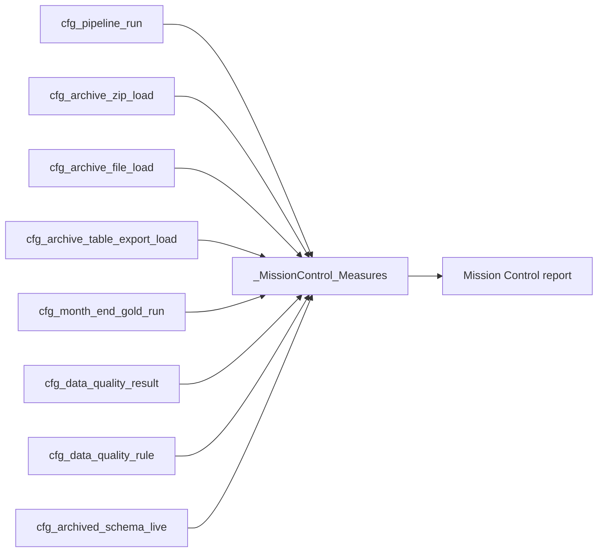

# Mission Control dashboard overview and KPI logic

## Purpose

Mission Control is the operational report for the WMPP platform. It answers whether scheduled pipeline work completed, whether archive/replay work is queued, whether data-quality checks failed, and what archived-schema evidence has been captured. It is separate from the referral performance report.

Use this document with [the Mission Control DAX build guide](MISSION_CONTROL_SEMANTIC_MODEL_DAX_BUILD_GUIDE.md), the measure artifact at `reports/current/_MissionControl_Measures.tmdl`, and the wireframe at `reports/mission-control/index.html`.

## What the client package supports now

The inspected client-deliverable semantic model provides `cfg_pipeline_run`, archive control tables, month-end Gold run control, DQ results/rules, and archived schema capture. It does not currently include the job-step, schema-drift, referential-exception, rejected-row or data-domain tables shown as future sources in the wireframe.

The package also has no measure-table file even though the report references `_Measures`. Its 18 referenced measures are referral KPIs, including `Total Referrals`, `Active Referrals Under Offer`, and `Open Referral Previous Month`. They are not valid Mission Control metrics. Rebind those report visuals to `_MissionControl_Measures` or replace the visuals before publishing.

## Operating model

`run_id` is the intended operational drillthrough key. Confirm that `cfg_pipeline_run` has one row per run before creating one-to-many relationships. If it does not, create a one-row-per-run dimension in Power Query.

## Pages and visual contract

| Page | State | Sources | Required measures | Slicers and drillthrough |
| --- | --- | --- | --- | --- |
| Executive overview | Available now | Pipeline, archive, DQ, snapshot control | Pipeline Runs, Pipeline Success Rate, Failed Pipeline Runs, DQ Failed Checks, Reload Requests, Operational Exception Count | Pipeline name, status, run/date; drill to a run or failed control item |
| Live ETL | Available now | `cfg_pipeline_run` | Live Pipeline Runs, Live Pipeline Failures, Average Pipeline Duration (min), Pipeline Tables Succeeded, Pipeline Rows Written | Fixed `pipeline_name = "90_run_live_pipeline"`; optional status and date |
| Archive ETL | Available now | Archive ZIP/file/export, Gold snapshot control, pipeline run | Archive ZIP Batches, Archive File Failures, Archive Files Awaiting Reload, Archive Table Exports Awaiting Reload, Gold Snapshots Awaiting Replay | Export date, snapshot date, reload and status; never mix archive batch metrics with the Live page |
| Data quality | Available now | DQ result and DQ rule | DQ Checks, DQ Failure Rate, DQ Failed Rows, Critical Rules Failing, RI Rules Failing | Rule ID, severity, rule type, table/column and run ID; sample-key detail only on authorised pages |
| Archived schema inventory | Available now | `cfg_archived_schema_live` | Archived Schema Columns, Archived Schema Tables, Latest Archived Schema Capture, Archived Nullable Columns, Archived Schema Data Types | Schema, table, data type and capture date |
| Job steps and errors | Deferred | Missing `vw_job_step_timing` or equivalent | No publishable measures yet | Import step sequence, duration, status, error text and preceding-step gap first |
| Schema drift and contract | Deferred | Missing drift event/contract source | No publishable drift counts yet | Import event key, event status/type, detected/resolved timestamps and expected/actual types first |
| Referential exceptions | Deferred | Missing referential-exception source | DQ-derived RI rule counts only | Import exception grain and relationship identifiers before showing orphan-record counts |
| Data domains | Deferred | Missing `cfg_data_domain` source | No publishable profile measures yet | Import profile timestamp, source/column and controlled value keys first |

## KPI logic

| KPI | Definition | Use and limit |
| --- | --- | --- |
| Pipeline Success Rate | Successful completed pipeline runs / successful plus failed pipeline runs | Excludes still-running runs from the denominator. Check status vocabulary after first refresh. |
| Pipeline Rows per Minute | Pipeline rows written / total elapsed minutes | Throughput signal only; it is not an insert/update/delete audit. |
| Failed Pipeline Runs | Distinct `run_id` where status is failed, fail or error | Drill to `error_message`. A single run can appear in several archive-control failures, so do not sum it with child control failures as a unique-run count. |
| Reload Requests | Sum of ZIP, archive-file, archive-table-export and Gold-snapshot reload flags | A queue of requested actions by control-object type, not a count of unique jobs. |
| Gold Snapshots Awaiting Replay | Month-end Gold control records with `reload = TRUE()` | Slice by `snapshot_date`; do not use it as a live-pipeline health metric. |
| DQ Failure Rate | Failed DQ checks / evaluated DQ checks | Rule-execution rate; use Weighted DQ Failure Percentage for row-level impact. |
| Weighted DQ Failure Percentage | Failed rows / checked rows | Protects against a small number of severe checks being hidden by a high check count. |
| Critical Rules Failing | Distinct critical rule IDs with failed/fail/error result | Operational escalation card. |
| RI Rules Failing and RI Failure Rate | DQ results whose `rule_type` is `REFERENTIAL_INTEGRITY` | Shows RI rule outcomes only. It is not an orphan-record count until the missing exception table is imported. |
| Archived Schema Tables | Distinct schema/table pairs in archived schema capture | Inventory metric, not contract-drift detection. |
| Operational Exception Count | Failed pipeline/control items plus failed DQ checks | Category total for executive triage; it deliberately does not deduplicate events across source tables. |

## Visual implementation

Use the `index.html` wireframe as the layout guide. Bind each card and chart to the available-now measures only:

- Executive cards: Pipeline Success Rate, Failed Pipeline Runs, DQ Failed Checks, Reload Requests and Operational Exception Count.
- Live ETL: pipeline status matrix by `pipeline_name`, duration trend, tables succeeded/failed, rows written and error-message drillthrough.
- Archive ETL: ZIP/file/export status matrix with export date and reload slicers, plus Gold snapshot readiness by snapshot date.
- Data quality: failed rules by severity and rule type, a failed-row trend by `checked_at`, and a secure detail table with rule ID, source table, column, message and sample-key availability.
- Archived schema: schema/table/column matrix, data-type distribution and capture-recency card.

Hide or label as planned the wireframe pages for steps, drift, referential exceptions and domains until their supporting sources are imported. Do not use placeholder values in production cards.

## Thresholds and alerting

| Indicator | Initial threshold | Action |
| --- | --- | --- |
| Failed Pipeline Runs | More than 0 in current filter | Drill to error message and assess affected layer |
| Pipeline Success Rate | Below 100% for completed runs | Investigate status and retry path |
| Reload Requests | More than 0 | Review queue owner, attempt count and schedule |
| Critical Rules Failing | More than 0 | Escalate before downstream reporting use |
| Weighted DQ Failure Percentage | Any non-zero value, prioritised by severity and failed rows | Review failed rule detail |
| Latest Archived Schema Capture | Older than the agreed archive cadence | Confirm schema capture pipeline and source availability |

## Security and retention

Error messages and `sample_key_json` may contain operationally sensitive detail. Keep them off the executive overview, apply workspace/app audience controls to drillthrough detail, and avoid exposing raw sample keys outside authorised support users.

## Acceptance checks

1. `_MissionControl_Measures` loads with all 67 measures and no unresolved table or column references.
2. Status cards reconcile to table visuals after confirming the real status values.
3. A selected `run_id` filters DQ, archive and Gold-control evidence through a validated relationship or a one-row-per-run bridge.
4. Live page excludes archive batch metrics; archive page includes export/snapshot/reload controls.
5. The report no longer uses the delivered referral KPI bindings.
6. Deferred pages are hidden or explicitly labelled until their source tables are available.
