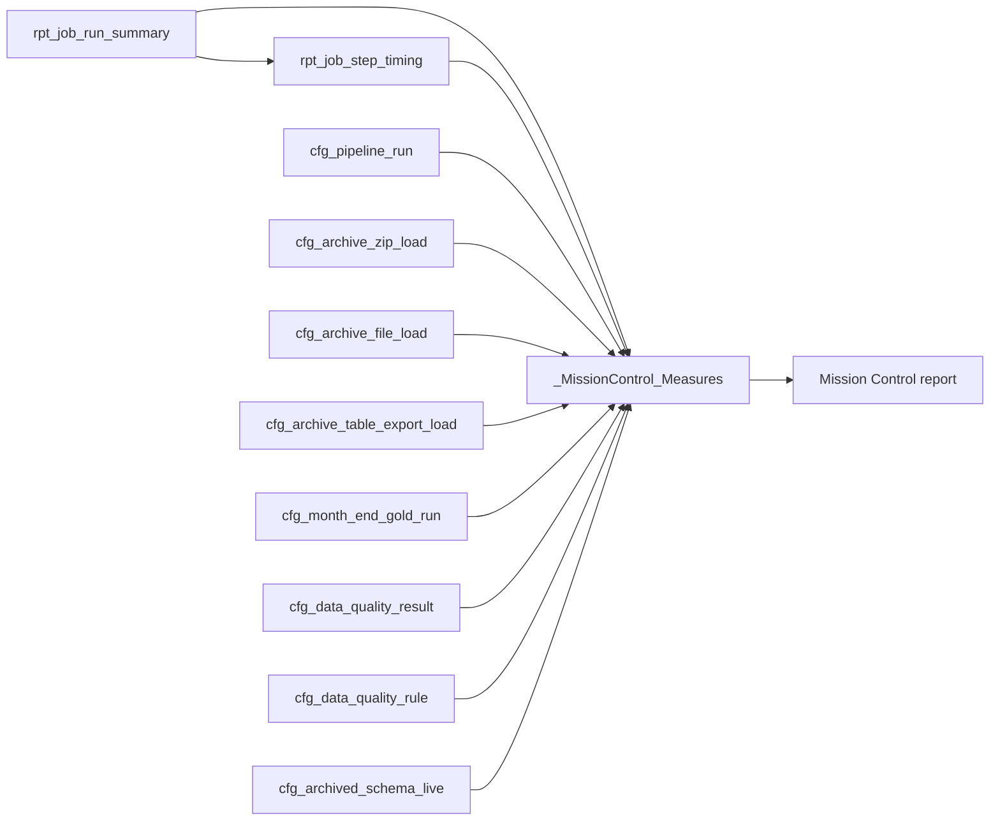

# Mission Control dashboard overview and KPI logic

## Purpose

Mission Control is the operational report for the WMPP platform. It answers whether scheduled pipeline work completed, whether archive/replay work is queued, whether data-quality checks failed, and what archived-schema evidence has been captured. It is separate from the referral performance report.

Use this document with [the Mission Control DAX build guide](MISSION_CONTROL_SEMANTIC_MODEL_DAX_BUILD_GUIDE.md), the measure artifact at `reports/current/_MissionControl_Measures.tmdl`, and the wireframe at `reports/mission-control/index.html`.

## What the client package supports now

The repository candidate at `reports/current/SM WMPP Mission Control v16`
provides `cfg_pipeline_run`, archive controls, month-end Gold run control, DQ
results/rules, archived schema capture, `rpt_job_run_summary` and
`rpt_job_step_timing`. It now includes `_MissionControl_Measures` with 87
measures and a six-page monitoring-only PBIR report. The earlier referral KPI
bindings have been removed from this candidate.

Schema-drift event detail, referential-exception detail, rejected-row detail
and data-domain profiling remain future imports. Current job-summary drift
counts and DQ-derived RI metrics must not be presented as row-level event or
orphan-record evidence.

## Operating model

`job_run_id` is the orchestration and cross-visual key. `run_id` identifies a
child notebook execution and remains useful for deeper pipeline drillthrough.

## Pages and visual contract

| Page | State | Sources | Required measures | Slicers and drillthrough |
| --- | --- | --- | --- | --- |
| Mission Control Overview | Implemented | Job summary and pipeline execution | Control health, job-run and all 21 pipeline-execution measures | Status distribution and recent job/exception table; use the timeline page for run-level drill |
| Job Runs & Steps \| Last 14 Days | Implemented | `rpt_job_run_summary`, `rpt_job_step_timing` | Job selection and job-step measures | Locked refreshed 14-day window; pipeline/status/job slicers; job Gantt cross-filters step Gantt and table; right-click drillthrough by `job_run_id` |
| Data Quality & Schema | Implemented | DQ result/rule and archived schema | All 16 DQ and five schema-inventory measures | Severity, outcome and rule-type slicers; sample-key detail is restricted to authorised audiences |
| Archive & Replay | Implemented | Archive ZIP/file/export and Gold snapshot control | All 21 archive-control measures | ZIP, file-load and snapshot tables expose reload, attempt, status and error evidence |
| Job Step Detail | Implemented, hidden | Job summary, step timing and pipeline execution | Selected job status, duration and step counts | Drillthrough filter on `rpt_job_run_summary[job_run_id]` |
| Job Run Tooltip | Implemented, hidden | Selected/latest job measures | Job ID, status, duration and failed steps | Used by the timeline visual containers |
| Schema drift, referential exceptions and data domains | Deferred | Missing event/exception/domain source grain | No source-complete detailed measures yet | Import governed source tables before creating dedicated pages |

## KPI logic

| KPI | Definition | Use and limit |
| --- | --- | --- |
| Pipeline Success Rate | Successful completed pipeline runs / successful plus failed pipeline runs | Excludes still-running runs from the denominator. Check status vocabulary after first refresh. |
| Pipeline Rows per Minute | Pipeline rows written / total elapsed minutes | Throughput signal only; it is not an insert/update/delete audit. |
| Failed Pipeline Runs | Distinct `run_id` where status is failed, fail or error | Drill to `error_message`. A single run can appear in several archive-control failures, so do not sum it with child control failures as a unique-run count. |
| Reload Requests | Sum of ZIP, archive-file, archive-table-export and Gold-snapshot reload flags | A queue of requested actions by control-object type, not a count of unique jobs. |
| Gold Snapshots Awaiting Replay | Month-end Gold control records with `reload = TRUE()` | Slice by `snapshot_date`; do not use it as a live-pipeline health metric. |
| DQ Failure Rate | Failed DQ checks / evaluated DQ checks | Rule-execution rate; use Weighted DQ Failure Percentage for row-level impact. |
| Weighted DQ Failure Percentage | Failed rows / checked rows | Protects against a small number of severe checks being hidden by a high check count. |
| Critical Rules Failing | Distinct critical rule IDs with failed/fail/error result | Operational escalation card. |
| RI Rules Failing and RI Failure Rate | DQ results whose `rule_type` is `REFERENTIAL_INTEGRITY` | Shows RI rule outcomes only. It is not an orphan-record count until the missing exception table is imported. |
| Archived Schema Tables | Distinct schema/table pairs in archived schema capture | Inventory metric, not contract-drift detection. |
| Operational Exception Count | Failed pipeline/control items plus failed DQ checks | Category total for executive triage; it deliberately does not deduplicate events across source tables. |

## Visual implementation

The current PBIR is generated by
`tools/rebuild_mission_control_dashboard_v16.py`. Every one of the 87 measures
is referenced by at least one KPI card, while the supporting tables retain the
row-level identifiers, times, outcomes, volumes and error evidence needed for
triage.

The job timeline uses two `Gantt1448688115699` visuals. The job Gantt binds
start/end time, pipeline, status and `job_run_id`; the step Gantt binds start
time, corrected duration-in-days, job ID, notebook and status. Explicit visual
interactions make the job Gantt and job table selection sources for both step
targets. The hidden drillthrough page provides the full job/step/pipeline
record when a single job requires investigation.

The 14-day window is represented by
`rpt_job_run_summary[job_run_window]`, calculated at semantic-model refresh,
and a locked page filter on `Last 14 days`. Keep the refresh schedule current
and do not reinterpret this as a rolling DirectQuery predicate between
refreshes.

## Thresholds and alerting

| Indicator | Initial threshold | Action |
| --- | --- | --- |
| Failed Pipeline Runs | More than 0 in current filter | Drill to error message and assess affected layer |
| Pipeline Success Rate | Below 100% for completed runs | Investigate status and retry path |
| Reload Requests | More than 0 | Review queue owner, attempt count and schedule |
| Critical Rules Failing | More than 0 | Escalate before downstream reporting use |
| Weighted DQ Failure Percentage | Any non-zero value, prioritised by severity and failed rows | Review failed rule detail |
| Latest Archived Schema Capture | Older than the agreed archive cadence | Confirm schema capture pipeline and source availability |

## Security and retention

Error messages and `sample_key_json` may contain operationally sensitive detail. Keep them off the executive overview, apply workspace/app audience controls to drillthrough detail, and avoid exposing raw sample keys outside authorised support users.

## Acceptance checks

1. `_MissionControl_Measures` loads with all 87 measures and no unresolved table or column references.
2. Status cards reconcile to table visuals after confirming the real status values.
3. The Job Runs & Steps page is locked to `job_run_window = "Last 14 days"`
   after refresh.
4. Selecting a `job_run_id` in the job Gantt or job table filters both the step
   Gantt and ordered step-detail table to that job.
5. Right-click drillthrough opens the hidden job page with its summary, every
   notebook step and linked pipeline execution rows.
6. Step Gantt duration is `step_duration_seconds / 86400.0` and is never
   multiplied by zero.
7. Every report field resolves to the local Mission Control model, all 87
   measures are referenced, and no referral KPI binding remains.
8. Live client refresh, tenant custom-visual approval, layout inspection and
   sensitive-field authorization are confirmed before publish.
