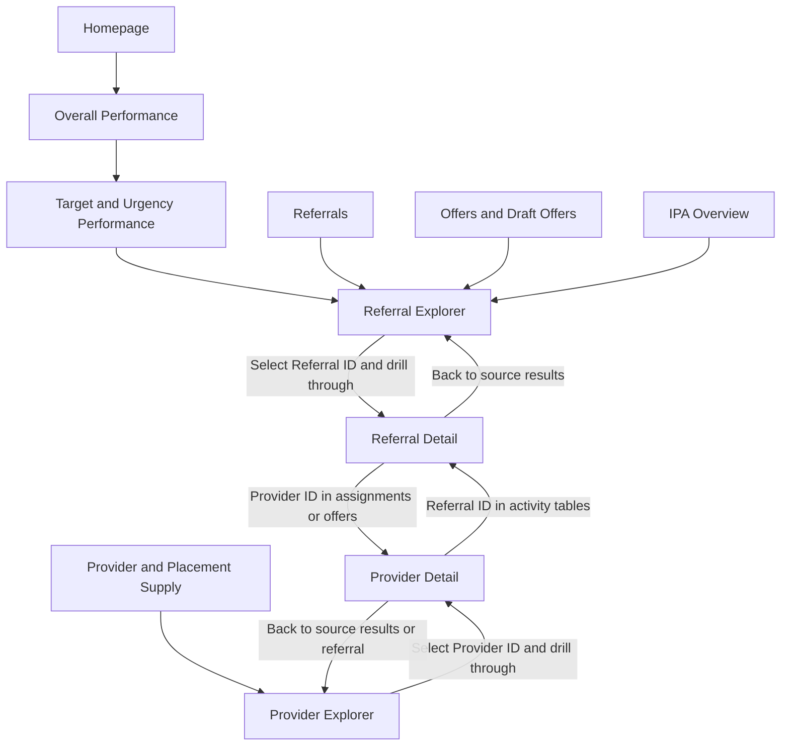

# WMPP report journeys and improvement review

Reviewed 3 October 2026 against the saved project under `reports/WIP/SM WMPP v16 updated WIP`. This review covers all 34 page definitions, their saved fields, action destinations, drillthrough bindings, bookmark definitions and the relevant model and Gold calculations. It is a structural and semantic review, not a completed walkthrough of the rendered report or a reconciliation of live values.

The report has a useful overview to explorer to detail structure, but it is not ready for release acceptance. The largest remaining problems are unclear time populations, repeated presentations, weak transitions from aggregate exceptions to case lists, and scoring evidence that could be mistaken for an approved rating. The changes below improve the explorer paths without inventing missing source events or scoring policy.

## Project and verification boundary

The edited project is `C:\repos\BCT\fabric-csv-bronze-ingestion\project X\reports\WIP\SM WMPP v16 updated WIP\SM_WMPP_v16.pbip`. The older client-deliverables copy and ZIP are separate baselines and were not edited. The saved model now contains 67 tables and 459 measures; many are display, selection and compatibility calculations, not additional business KPIs.

Saved-reference checks found no missing visual fields or nonexistent action destinations. Runtime DAX, rendered layout, filter propagation with real records, refresh and identity-based security remain unverified. The Desktop-control connection timed out. Nothing was published, and source queries, caches and security roles were not changed. The WIP manifests record the touched files and recoverable backups.

## Journeys through the report

The arrows below show the intended navigation and decision sequence. They do not claim that every chart already carries its selected context between pages. Native drillthrough requires the same unaggregated record field on the source visual and destination; ordinary navigation does not establish a record selection. See [Microsoft drillthrough guidance](https://learn.microsoft.com/en-us/power-bi/create-reports/desktop-drillthrough).

| User goal | Journey | Decision and return path |
| --- | --- | --- |
| Understand overall demand and pressure | Homepage → Overall Performance → Target and Urgency Performance → Referral Explorer → Referral Detail | Distinguish workload, overdue cases, snapshot movement and closure flow. Select a referral, inspect its next action, then use Back to return to the results. |
| Resolve an individual referral | Referrals → Referral Explorer → search or select stage → referral result → Referral Detail → related Provider Detail | Compare assignments, offers, messages and recorded lifecycle evidence. Provider IDs are now available in the referral offer and assignment tables for provider drillthrough. Back should return to the originating referral, not reset the search. |
| Assess provider engagement and supply | Provider and Placement Supply → Provider Explorer → provider search or home service filter → provider result → Provider Detail | Start from the full provider directory, including zero-offer providers. Read activity totals, then scoring evidence for a stated assignment period. Inspect all homes and their actual offer attribution. |
| Chase an offer or IPA | Offers Overview or Draft Offers → Referral Explorer → Referral Detail → offer and IPA evidence | Confirm whether an offer is draft, submitted, accepted or terminal. An accepted offer without an IPA is a chase item. An unsigned IPA is different from an uncreated IPA. The report does not itself update the source workflow. |
| Investigate location or distance | Offer Locations → related referral record → Referral Detail location map and directory | Read coordinate coverage and distance status first. Provider postcodes and referral city preferences are approximate locations, not proof of suitability or a child's precise address. |
| Review requirement support | Requirement Matrix Overview → KPI and requirement evidence → relevant reporting page | A requirement linked to a KPI is reporting coverage, not proof that the portal workflow, security requirement or service level is complete. |

Back is source-relative: Provider Detail entered from a referral should return to that referral. The diagram's explorer return branches are examples, not a fixed destination for the native Back action.

## Referral lifecycle and provider lifecycle

The referral rail is a refresh-time classification of current evidence: created → assigned → offers available → offer accepted → IPA issued → both signatures recorded. Closure, cancellation or withdrawal is a separate terminal outcome and can occur before any of those milestones. Unknown evidence is a review case. Do not read the rail as a measured historical conversion funnel, assume every case passed every stage, or equate signed paperwork with confirmed admission. Use the lifecycle event list to inspect recorded history.

The provider rail describes a provider's furthest evidenced stage in the current context: message activity → offers made → offer accepted → provider signed. A provider may have many simultaneous referrals at different stages. Message activity includes either sender, browsing is unavailable, and separate provider confirmation is not captured. Assigned or draft-only providers and providers with no activity sit outside the main rail and need explicit counts, not a fabricated stage. Both parties signed is a subset, not an additional mutually exclusive provider stage.

## Changes implemented in this WIP

- Retained entity-first referral and provider directories. An offer is not required to appear in either explorer.
- Moved the result lists ahead of secondary analysis and raw activity. Added current-selection captions, empty-result guidance and visible selected-record drillthrough controls.
- Changed existing menu jumps to record detail into drillthrough actions. Added canonical Provider IDs to referral activity and canonical Referral IDs to provider activity so the cross-entity route can carry the correct key.
- Added a compact headline KPI row to each explorer and both detail pages. The provider headlines focus on selected providers, distinct offers made, messages and unanswered assignments. Referral headlines focus on matching referrals, open overdue cases, open cases without offers and accepted offers without an IPA.
- Expanded the provider and referral KPI catalogues to 24 and 18 rows respectively, with regular-weight labels and definitions. Detail-page KPI summaries require one canonical record key.
- Added provider scoring evidence on both provider pages and an explicit assignment-month selector. The scoring period affects cohort evidence, not all current activity totals. Response-speed evidence uses the selected assignment months too.
- Added cohort response rate, accepted offer share and opportunity count to the provider result table. The separate scorecard exposes numerators, denominators, evidence rules and unavailable components.
- Updated both explorer guide pages for entity-first search, action KPIs, stage selection, scoring periods and record-key drillthrough.
- Hid the provider explorer's generic selected-metric donut, acceptance ranking bar and unused metric selector, preserving their files. Their bookmark visibility states also keep them hidden. Removed duplicate provider-detail summary cards from view because the new headline row already shows those metrics; the profile now uses the width available.
- Corrected the Referrals chart title that called a placement-type comparison a monthly trend. Replaced requirement summary cards that aggregated identifier strings with distinct catalogue and linkage counts. Linkage is explicitly not delivery completion.

## Additional KPIs and their limitations

| KPI | Why it helps | Interpretation limit |
| --- | --- | --- |
| Open referrals without offers | Identifies cases that still need a viable offer search | No offer record means no draft either; it is not the same as no submitted offer. |
| Open referrals without assignments | Highlights cases without a recorded provider search assignment | Missing extraction can resemble genuine missing activity. |
| Accepted offer but no IPA | Creates a concrete paperwork chase list | A missing IPA record is not proof of an officer delay. |
| IPAs awaiting either signature | Separates issued paperwork from completion | Missing signature evidence is included; this is not confirmed placement start. |
| Open overdue share | Adds the scale of overdue pressure to its count | Uses open referrals in the same selection as denominator. |
| Assignments without qualifying response | Highlights provider activity worth checking | Requires a recorded assignment start and false response flag; no business-calendar SLA failure is inferred. |
| Response timing coverage | Exposes the completeness behind response-time statistics | Missing durations are not treated as zero or fast responses. |
| QA flagged homes | Makes current flagged homes discoverable | A flag is not a provider quality-of-care score or an attribution to every home. |
| Providers without recorded activity | Keeps dormant or newly registered providers visible | No recorded activity is not evidence of poor performance. |

## Provider scoring evidence

The new scorecard displays qualifying response rate, accepted offer share, placed-by-target share and median recorded response hours. Missing denominators return insufficient evidence. Rates are calculated from pooled component counts, not averages of provider percentages. Median hours is recomputed from assignment-level durations, not averaged from monthly medians.

The Gold offer component currently counts offer records attributed to assignment cohorts, including drafts. Its accepted share must not be silently renamed submitted-offer conversion. Activity offers made is a different measure that excludes drafts and missing statuses. Both populations are documented in the report.

Document compliance, moderated officer feedback, governed decline handling, comparable cost and an overall score remain explicitly unscored or not approved. There are no invented weights, minimum-sample thresholds, rankings or red/amber/green scoring cut-offs. This evidence is provider-level: provider assignments and responses must not be duplicated across homes or presented as a home score. See the [provider scoring implementation guide](PROVIDER_SCORING_IMPLEMENTATION_GUIDE.md).

## Critical gaps still requiring work

| Priority | Gap and evidence | Recommended improvement |
| --- | --- | --- |
| Release blocker | The open Desktop report has not been verified against these saved changes | Safeguard unsaved work, reload the correct WIP and complete the acceptance checks below. Do not save a stale session over updated files. |
| High | Aggregate exception charts and navigational bookmarks do not by themselves carry a case cohort into an explorer | Add explicit filtered drillthrough paths or controlled cohort selectors for overdue, no-offer and accepted-without-IPA lists. Label simple navigation as navigation, not a filtered handover. |
| High | Current state, creation-date cohorts, assignment-month cohorts, closure flow and month-end snapshots coexist | Place the time basis beside each section. Keep the existing closure-date flow separate from snapshot closed state. Do not compare an incomplete month with a complete month without marking it. |
| High | Provider monthly Gold rows include security scope as well as provider and month | Reconcile multi-scope assignments and numerator duplication under actual RLS before using pooled values for comparison. A saved field-reference check cannot establish this. |
| High | Estimated cost is not actual spend | Keep estimated weekly cost with its coverage. Move lifetime-cost estimates away from the headline row until planned dates, missing fees, future dates, rate changes and filter removal are agreed. |
| High | Scoring policy and several evidence sources are absent | Approve versioned weights, eligibility, exclusions, minimum samples, peer groups and dispute handling before any overall ranking. Do not manufacture an overall score in DAX. |
| Medium | A home-service filter narrows provider eligibility, but assignments and responses remain provider-level | Make that scope clear in the filter label and scoring caption. Do not infer per-home responsiveness from provider-level opportunities. |
| Medium | Provider Explorer and Detail are still long evidence pages | Keep the result and action summary first. Consider collapsible evidence sections or a separate monthly evidence page after testing real usage; do not add another duplicate overview. |
| Medium | Too many chart and table pairs repeat a single population | Keep one visible presentation per question, with an accessible table toggle if needed. A repeated query is not automatically redundant when it is the alternative table view. |
| Medium | Retired Geography, Snapshots, Historic and original Explorer pages still exist | Verify that every navigation bookmark keeps retired destinations inaccessible. Retain archived definitions for recovery; do not casually delete bookmark dependencies. |
| Medium | Provider confirmation and browsing are absent | Retire them as numbered conversion stages or display them as unavailable evidence, never zero-performance stages. |
| Medium | Priority and urgency appear independently although business equivalence is unresolved | Show both in evidence tables while documenting the ambiguity; do not silently merge or delete a source field. |
| Medium | The two explorer guides now describe the revised paths, but guide rendering and other page guides still need review | Check text clipping, page-specific instructions and source-relative Back. Validate Ctrl-click behaviour in Desktop separately from reading mode. |

## Charts and KPIs to remove or consolidate

These are recommendations unless listed as implemented above. Saved chart/table pairs may be alternative bookmark views; verify their visibility before removing a representation.

| Existing item | Recommendation | Reason |
| --- | --- | --- |
| Provider Explorer selected-metric donut and acceptance ranking bar | Hidden in this change; use result and KPI tables | Generic titles, unclear placement attribution and rate ranking without comparable evidence make them poor search tools. |
| Duplicate provider-detail homes and offers cards | Hidden in this change | The headline summary already shows the same metrics. |
| Overall Performance status donuts | Keep one status overview, not both | Two charts use the same current-status and referral-count fields. The alternative table can remain for exact values. |
| Overall Performance urgency and target chart/table pairs | Show one presentation at a time; move detailed distributions to Target and Urgency Performance | Repetition dilutes the overview's purpose. |
| Overall Performance provider offer comparison | Move to provider analysis | The overview should prioritise workload, target pressure and estimated cost, rather than repeat provider league tables. |
| Total Lifetime Cost headline | Remove from the main headline row pending definition review | The measure removes IPA filters, uses planned/admission dates and estimated weekly rates, and falls back to today's date. It is not an actual expenditure ledger. |
| Referrals male, female and other counts | Move to a demographic section unless a requirement makes them operational headlines | They do not directly answer which referral needs action next. |
| First Contact or engagement percentage as a provider-performance headline | Relabel as recorded activity or move to detail | First action and current engagement flags do not prove provider-authored contact, browsing or response SLA. |
| Offers per Qualifying Provider funnel | Use a sorted provider count table or bar, not a funnel | Independent providers are not sequential lifecycle stages. |
| IPA workflow funnel and multiple near-identical conversion ratios | Keep distinct actionable counts plus one clearly defined ratio | Accepted offers, IPA records and completed records can have different grains; the stages are not automatically one deduplicated conversion population. |
| Draft no-activity count and percentage | Keep the count plus age bands; move the percentage to the KPI list | The chase decision depends on which drafts and how old they are. Retain the percentage only where it has a distinct comparison purpose. |
| Referral Detail duplicate location directories | Keep map plus one accessible directory | Two adjacent directories repeat provider/home/offer/address fields and consume space without a distinct question. |
| Requirements Complete inferred from KPI linkage | Replaced in this change | A mapping supports reporting coverage, not requirement delivery or acceptance. |
| Small cards using KPI IDs for information icons | Keep as helper visuals, not count as business KPIs | These support tooltip or information navigation and are not substantive performance measures. |

## Acceptance walkthrough

1. Start at Homepage and follow every route in the journey table. Confirm page labels, dropdown placement, filter drawers and Back behaviour at normal and increased zoom.
2. Search for a referral without offers and a provider without offers or homes. Confirm they remain discoverable, with genuine zero activity distinguished from missing evidence.
3. Select several providers and reconcile distinct offers, assignments and messages against keys. Select one record and use both the drillthrough button and right-click route.
4. From Referral Detail, drill into a Provider ID and return to the same referral. From provider activity, drill into a Referral ID and return to the provider context.
5. Change scoring assignment month. Reconcile numerator and denominator to Gold at provider/month/security-scope grain; verify that current activity totals do not pretend to use that month. Check median timing on the same assignment cohort.
6. Check zero denominators, no duration evidence, multiple months, unknown statuses, missing home IDs and no matching rows. Overall score must remain not approved.
7. Open and close every filter/menu, select and clear a journey stage, and switch any remaining chart/table views. The archived provider charts and duplicate detail cards must stay hidden.
8. Validate cost, snapshot and closure populations separately. Run representative identities under RLS and reconcile multi-scope Gold rows before release.

The current assessment is **needs revision for release**, despite the implemented improvements and passing saved-file checks. Rendered and data acceptance must close the high-priority gaps before client sign-off.
